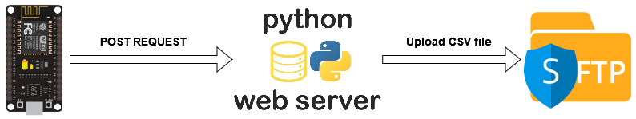

# **<span style="text-decoration:underline;">Réalisation d'un compteur pour mesurer la fréquentation en bibliothèque</span>**

## **Le projet**
Pour répondre à la demande du client sur le besoin de détecteurs pour les entrées et sorties de la médiathèque, nous avons choisi des capteurs infrarouges E18-D50NK avec un ESP8266. L'utilisation de capteur infrarouges permet de détecter le passage sur une trentaines de centimètre, il est adapté pour comptabiliser les entrées depuis une porte ou un portique de sécurité. Les données sont envoyé sur un poste sur lequel un script python est chargé d’écouter sur un port les requète de l’ESP pour ensuite traiter les données

## **Procédure**
Nous avons choisi d’utiliser Arduino pour coder sur l’ESP8266. Pour commencer à utiliser l’ESP8266, il faut flasher le contrôleur. Avant de le flasher il faut installer les drivers nécessaires sur son PC : [https://cityos-air.readme.io/docs/1-usb-drivers-for-nodemcu-v10](https://cityos-air.readme.io/docs/1-usb-drivers-for-nodemcu-v10)

Bien vérifier que la version de son NodeMCU pour prendre le bon driver !

**Nous avons passé un bon moment à essayer de comprendre pourquoi il était impossible de voir l’ESP8266 avec notre PC même avec le bon pilote installé. Le problème venait du câble usb qui était un câble de chargeur de téléphone et non pas un câble data !**

Une fois que le NodeMCU est visible et connecté au PC, nous avons suivi la procédure suivante pour flasher le micro-contrôleur: [https://create.arduino.cc/projecthub/pratikdesai/flash-firmware-on-esp8266-esp-01-module-e1f758](https://create.arduino.cc/projecthub/pratikdesai/flash-firmware-on-esp8266-esp-01-module-e1f758)

Une fois flashé, nous avons utilisé le logiciel Arduino IDE pour envoyer notre code sur l’ESP8266. Il a ensuite fallu intégrer manuellement l’ESP8266 au logiciel car il n’est inclus par défaut. Pour télécharger ARDUINO IDE: [https://www.arduino.cc/en/software](https://www.arduino.cc/en/software)

Pour intégrer l’ESP8266 à Arduino IDE: [https://randomnerdtutorials.com/how-to-install-esp8266-board-arduino-ide/](https://randomnerdtutorials.com/how-to-install-esp8266-board-arduino-ide/). **Randomnerdtutorials** est un site très pratique car il recense différents projets avec des ESP.

Nous avons ensuite travaillé sur les codes pour connecter l’ESP8266 au Wi-Fi, récupérer les informations des capteurs et compiler les données dans un fichier qui est ensuite envoyé en .csv sur un serveur HTTP. A savoir qu’il est nécessaire que l’ESP récupère la date et l’heure via NTP pour faire l’envoi en HTTP.

La demande initiale était d’envoyer le fichier en SFTP. Après quelques recherches, nous avons découvert que SFTP n’est pas implémenté sur les ESP8266. Nous nous sommes donc intéressés au HTTPS. Après plusieurs essais, nous avons remarqué que l’ESP8266 n’était pas assez puissant pour envoyer des données avec autre chose que du HTTPS en SHA-1. Cette méthode n’étant pas sécurisée, nous avons choisi d’envoyer les données en HTTP vers un serveur Web Python qui se chargera de créer le fichier CSV afin de l'envoyer vers le serveur SFTP.

Voici le schéma de fonctionnement :


## **Code ESP8266**
Code Wi-Fi:
```cpp
// Initialize Serial Monitor
Serial.begin(115200);

// Connect to Wi-Fi
WiFi.begin("SSID", "PASSWORD");
while (WiFi.status() != WL_CONNECTED) {
  delay(500);
  Serial.print(".");
}

Serial.println();
Serial.print("Connected, IP address: ");
Serial.println(WiFi.localIP());
```

Code pour synchro NTP:
```cpp
WiFiUDP ntpUDP;
NTPClient timeClient(ntpUDP, "0.fr.pool.ntp.org");

// Update time with NTP
timeClient.begin();
timeClient.setTimeOffset(7200);
timeClient.update();
```

Code capteurs:
```cpp
int sensorValueEntrer= digitalRead(Entrer);
int sensorValueSortie = digitalRead(Sortie);
int firstDetectedTime;

// If someone is in front both sensor at the same time it restarts the loop
if(sensorValueEntrer == 0 and sensorValueSortie == 0){
  delay(500);
  loop();
}
else {

// If first sensor is triggered first, it means that someone can enter
if(sensorValueEntrer == 0){
  firstDetectedTime = millis();

  // It tries to detect during 1 second if the second sensor is triggered
  do {
    sensorValueSortie = digitalRead(Sortie);
    if(sensorValueSortie == 0){
      Serial.println("Entrée");
      break;
    }
  } while (firstDetectedTime + 1000 > millis());

  delay(500);
  loop();
}

// If second sensor is triggered first, it means that someone can go out
if(sensorValueSortie == 0){
  firstDetectedTime = millis();

  // It tries to detect during 1 second if the first sensor is triggered
  do {
    sensorValueEntrer= digitalRead(Entrer);
    if(sensorValueEntrer == 0){
      Serial.println("Sortie");
      break;
    }
  } while (firstDetectedTime + 1000 > millis());
  delay(500);
  loop();
}
delay(100);
```

Code pour le HTTP POST vers le serveur Web python :
```cpp
time_t epochTime = timeClient.getEpochTime();
struct tm *ptm = gmtime ((time_t *)&epochTime); 

String formattedTime = timeClient.getFormattedTime();
String currentDate = String(ptm->tm_year+1900) + "-" + String(ptm->tm_mon+1) + "-" + String(ptm->tm_mday);
String weekDay = weekDays[timeClient.getDay()];
  
// Enter the if statement only if the hours are between 8h and 19h and every 30 minutes
if (((timeClient.getHours() >= 8) || (timeClient.getHours() < 19)) && ((timeClient.getMinutes() == 30) || (timeClient.getMinutes() == 0)) && timeClient.getSeconds() == 00){
  String csv_entry = currentDate + ',' + formattedTime + ',' + 0 + ',' + 0 + ',' + "ALLI1,Counter A,RDCentre,Alliance,ALLI";

  // Check if we are connected to the wifi
  if(WiFi.status()== WL_CONNECTED){
    WiFiClient client;
    HTTPClient http;

    // The IP address and the port of the web server to connect
    http.begin(client, "http://192.168.43.133:8080/");

    // Specify the content-type header
    http.addHeader("Content-Type", "text/plain");

    // Send an HTTP POST request with the csv string
    int httpResponseCode = http.POST(csv_entry);

    // Check if the request have been send successfully
    if (httpResponseCode != 200)
    {
      Serial.println("Can't send POST request to the web server");
    }

    else {
      Serial.println("POST request send to the web server");
    }

    // Free resources
    http.end();
  } 

  else {
    Serial.println("WiFi Disconnected");
  }
delay(1000);
}
```
## **Code serveur Web Python**

Serveur Web :
```python
from http.server import BaseHTTPRequestHandler, HTTPServer

class handler(BaseHTTPRequestHandler):
  def do_POST(self):
    message = "OK"
    self.wfile.write(message.encode("utf-8"))

    self.send_response(200)
    self.send_header('Content-type','text/html')
    self.end_headers()

with HTTPServer(('192.168.43.133', 8080), handler) as server:
  server.serve_forever()
```

Envoi du fichier CSV vers le serveur SFTP : 
```python
try:
  ftp = FTP_TLS('192.168.43.254', user='client', passwd='')
  ftp = ftp.prot_p()

except error_perm as e:
  print(e)
  self.send_response(403)

print("Connected to FTP server")

mydate = datetime.datetime.now()
filename = mydate.strftime("%d_%m_%Y_counterdata-1.csv")

with open(filename, "a") as f:
  f.write(post_body)

file = open(filename, 'rb')
ftp.storbinary(f'STOR {filename}', file)
file.close()
ftp.quit()
```
